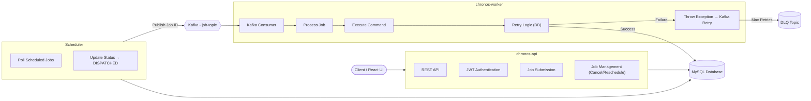

# Chronos — Distributed Job Scheduling System

A scalable, event-driven backend system for scheduling, executing, and monitoring jobs with support for retries, failure handling, and recurring execution.

##  System Architecture



## Overview

Modern systems require reliable execution of background tasks such as data processing, notifications, and scheduled workflows. Traditional cron-based approaches lack scalability, failure handling, and observability.

This project aims to build a distributed job scheduling system that supports reliable execution, retries, monitoring, and scalable processing using an event-driven architecture.

## Tech Stack
* Backend: Spring Boot (Java 17, Gradle)
* Messaging: Apache Kafka (KRaft mode)
* Database: MySQL
* Frontend: React
* Infrastructure: Docker, Docker Compose
* Security: JWT Authentication

## Core Capabilities
* Job Submission & Management: REST APIs to create (immediate/scheduled), cancel, reschedule, and view jobs.

* Recurring Execution: Interval-based recurring tasks with automatic nextRunTime calculation.

* Fault Tolerance: DB-level retry tracking, configurable retry delays, and a Kafka-based Dead Letter Queue (DLQ) for failed jobs.

* Observability: Structured logging and a dedicated JobRun entity tracking start/end times, status, output, and errors.

* Scalable Processing: Stateless scheduler and idempotent worker design allowing for horizontal scaling.

## Execution Flow
* Scheduler polls scheduled jobs from the database.

* Marks job as DISPATCHED.

* Publishes job ID to Kafka.

* Worker consumes the job and executes the command.

* Updates status and logs execution.

* Retries on failure, moving to the DLQ if max retries are reached.\

## Local Setup
Start the infrastructure and services:

## Bash
docker-compose up --build      

## Access Points:

Frontend: http://localhost:3000

Backend API: http://localhost:3092  

## API Usage
## Create a Job

JSON

POST /api/jobs
```json
{
  "command": "echo hello",
  "runAt": "2026-05-05T10:00:00Z"
}
```

## Create a Recurring Job

JSON

POST /api/jobs
```json
{
  "command": "echo recurring",
  "runAt": "2026-05-05T10:00:00Z",
  "repeatIntervalSeconds": 10
}
```

## Future Roadmap
Cron-based scheduling expressions

Distributed locks for multi-node scheduler deployment

Prometheus/Grafana metrics dashboard

                                                                                          

## Author

Satyam Singh
